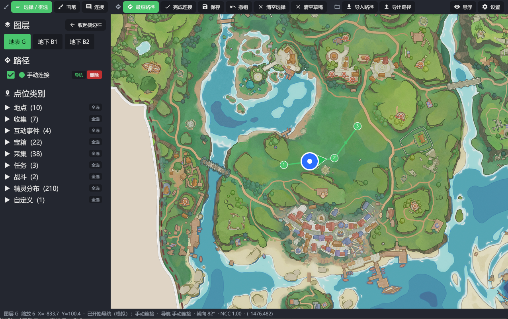

# where-to-go


《洛克王国：世界》桌面辅助工具。一款 Windows 单文件程序，把 [BWiki 大地图](https://wiki.biligame.com/rocom/大地图) 的瓦片和点位数据搬到本地，提供完整的浏览、路径规划，以及基于游戏小地图截屏识别的玩家定位与路径导航。

> 数据来源：BWiki（[wiki.biligame.com/rocom](https://wiki.biligame.com/rocom)）。这是社区维护的非官方资料站，并非游戏运营方提供。本工具不读写游戏内存、不注入游戏进程，仅做屏幕截图识别。

## 功能

- 大地图浏览：拖拽、滚轮缩放，地表 / 地下 B1 / B2 三层切换，支持 BWiki 收录的全部点位类别按需显示或隐藏。
- 路径规划：手工连点、自由绘制、TSP 自动连接最近邻；可保存、命名、按图层归档。
- 玩家定位：定期截取游戏右上角小地图，用边缘特征做 SSD 匹配，把世界坐标和朝向投到大地图上。
- 路径导航：选中已保存路径后，已走 / 未走两段着不同色，路径上嵌入流动箭头。
- 悬浮窗：透明置顶窗口叠在游戏之上，可调大小 / 透明度 / 鼠标穿透。
- 全局热键：开始追踪、切换悬浮窗、框选小地图等可在游戏窗口聚焦时直接触发。

## 安装

从release下载 `where-to-go.exe`，放到任意可写目录，双击运行。无需安装。

首次运行会从 BWiki 拉取地图元数据、点位、文本图层，以及缩放级别 z=4 的瓦片（最低细节、覆盖整图）。这一步需要网络。完成后所有内容存到 `<exe 同级目录>/cache/`，后续启动直接走本地。更高缩放的瓦片在你放大查看具体区域时按需下载。

如果可执行文件所在目录不可写（比如 Program Files），缓存会落到 `%LOCALAPPDATA%\where-to-go\cache\`。

## 使用

### 主界面

| 操作            | 方式                                   |
| --------------- | -------------------------------------- |
| 平移地图        | 中键拖动；选择"平移工具"后左键也可拖动 |
| 缩放            | 鼠标滚轮                               |
| 切换图层        | 左侧栏 G / B1 / B2 按钮                |
| 显示 / 隐藏类别 | 左侧栏勾选                             |
| 框选            | 选择工具下左键拖动                     |
| 添加自定义点    | 在地图任意空白处右键                   |
| 撤销            | `Ctrl+Z`（地图区域聚焦时）             |
| 回到原点        | 右下角按钮                             |

### 路径规划

1. 工具栏切到"链接""自由绘制"或"TSP"。
2. 在地图上依次点击或拖动产出节点。链接工具下点两个点会调用 A\* 在点位邻接图上自动布线；TSP 工具会用 K-NN + 2-opt 求选中点集的近似最短回路。
3. 点"保存草稿"，命名后写入 `<exe 同级目录>/data/routes/<name>.json`。
4. 侧栏"路径"区可勾选显示、重命名、删除。

### 玩家定位

匹配前提：游戏小地图设置为**固定北朝向**（不随玩家旋转）。

1. 启动游戏并把小地图调到固定缩放（推荐最大放大）。
2. 主界面或菜单点"框选小地图"（默认热键 `Ctrl+Alt+R`）。屏幕变暗后按住左键画矩形，**矩形要紧贴小地图圆形外缘，不要圈进 UI 边框**。松开确认。
3. 在地图上**右键玩家所在的真实位置**，菜单选"玩家在这里"。这一步会以你右键的坐标为真值在 K ∈ [0.5, 1.0] 范围扫描最佳缩放系数 K，写到 `data/calibration.json`，下次启动自动加载。
4. 主界面点"开始追踪"。每 ~600 ms 截一次小地图，识别出的位置 + 朝向叠到大地图上。
5. 选中一条路径点"开始导航"，匹配频率提升到 ~400 ms。路径会按当前进度自动分成已走 / 未走，自动居中可在设置里改成"始终居中 / 仅导航时居中 / 关闭"。
6. 玩家偏离路径时投影锁在当前段，不会跨段串到后续段。完成当前段后锁自动前进。

### 悬浮窗

| 默认热键     | 操作              |
| ------------ | ----------------- |
| `Ctrl+Alt+M` | 显示 / 隐藏悬浮窗 |
| `Ctrl+Alt+T` | 切换鼠标穿透      |
| `Ctrl+Alt+S` | 开始 / 停止追踪   |
| `Ctrl+Alt+R` | 框选小地图        |

悬浮窗内容是地图本体（无侧栏、无工具栏），与主窗口共享同一份 MapView 状态。穿透模式下窗口忽略所有鼠标事件，方便正常操作游戏。

某些游戏在独占全屏下不允许覆盖窗口；此时把游戏切到"无边框窗口"模式即可。

## 设置项

设置在 `<exe 同级目录>/config.json`。可在 UI 设置页修改后立即落盘。

| 字段                     | 含义                                        | 默认               |
| ------------------------ | ------------------------------------------- | ------------------ |
| `markerStyle`            | 点位样式：bubble / icon / dot               | icon               |
| `iconSize`               | 图标尺寸（像素）                            | 24                 |
| `selectionStyle`         | 选中点高亮：halo / dot                      | halo               |
| `minimapRoi`             | 小地图屏幕坐标                              | 空（首次需要框选） |
| `worldUnitsPerMinimapPx` | 校准系数 K：游戏小地图 1px 对应多少世界单位 | 0.5（待校准）      |
| `navSimulator`           | 模拟器模式（合成 fix，仅开发调试用）        | false              |
| `navTracking`            | 启动时自动恢复追踪                          | false              |
| `navCenterMode`          | 自动居中：off / always / navonly            | always             |
| `navFallback`            | 定位失败时：stay / last / lost              | stay               |
| `navSearchZoom`          | 用作底图匹配的 wiki 缩放                    | 8                  |
| `navPredict`             | fix 之间按速度外推显示位置                  | false              |
| `overlayAlpha`           | 悬浮窗透明度 0..255                         | 255                |
| `overlayClickThrough`    | 悬浮窗鼠标穿透                              | false              |
| `overlayProgressBar`     | 导航时悬浮窗顶部画进度条                    | true               |
| `lastPlayer*`            | 上次成功定位的世界坐标，重启后用作匹配种子  | 自动维护           |

## 命令行

```
where-to-go.exe                 正常启动
where-to-go.exe -reset          清空缓存重新抓取
where-to-go.exe -no-fetch       不联网（仅在本地缓存就绪时可用）
where-to-go.exe -cmd fetch      只执行抓取流程，不开 GUI
where-to-go.exe -cmd test-locator   用 testMinimapImg/ 跑定位回归（开发用）
where-to-go.exe -cmd test-overlay   仅打开悬浮窗（验证渲染管线）
where-to-go.exe -cmd test-hotkey    仅注册热键并打印事件
```

## 常见问题

**首次抓取失败 / 卡住**  
检查能否访问 `wiki.biligame.com` 与 `wiki-dev-patch-oss.oss-cn-hangzhou.aliyuncs.com`（瓦片 OSS 域名）。再次启动会从断点续抓；用 `-reset` 强制全量重抓。

**校准之后定位仍不准**  
最常见原因是 K 没校准对。在地图上右键玩家真实位置选"玩家在这里"，工具会自动扫描 K 并写盘；下次启动自动加载。如果你测试时移动了几格仍然偏，再校一次即可。

**追踪刚开始的几秒位置在跳**  
首帧会用宽搜索半径定位 + 写入种子；之后才进入小半径快速跟踪。如果游戏地图当前区域的瓦片还没下载到本地，匹配会先等瓦片到位再收敛，期间可能短暂"无反应"。把视图先在大地图上拖到玩家附近、让 z=8 瓦片预热一下能减少这段时间。

**悬浮窗在游戏全屏下不显示**  
切到无边框窗口模式。

**小地图边界附近无法识别**  
游戏地图边缘常带白色描边和大片未渲染白区，特征极弱，sharp 通常在 0.05 以下。当前实现会在这种场景拒绝低置信度结果，避免错位漂移；位置会在你离开边界、回到有特征的区域后由后台周期重定位（每 6 秒一次）自动恢复。

## 许可证

见 `LICENSE`。本工具仅做客户端屏幕识别，不修改游戏文件、不注入游戏进程、不读写游戏内存。

## 开发

源码与架构说明见 `docs/DEVELOPMENT.md`。
